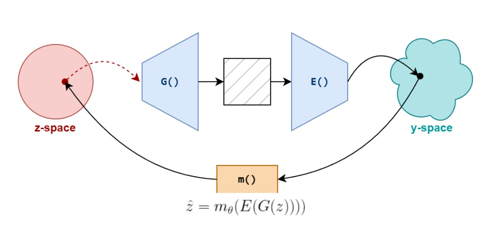
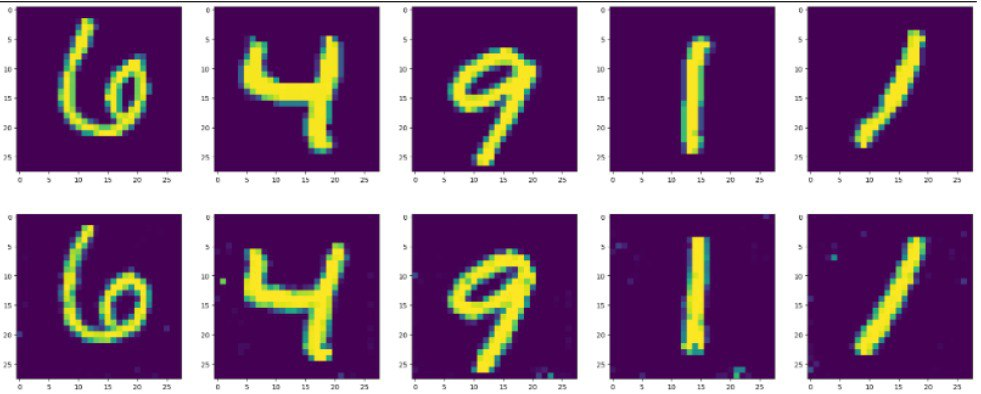
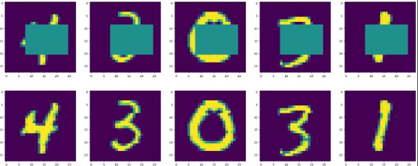
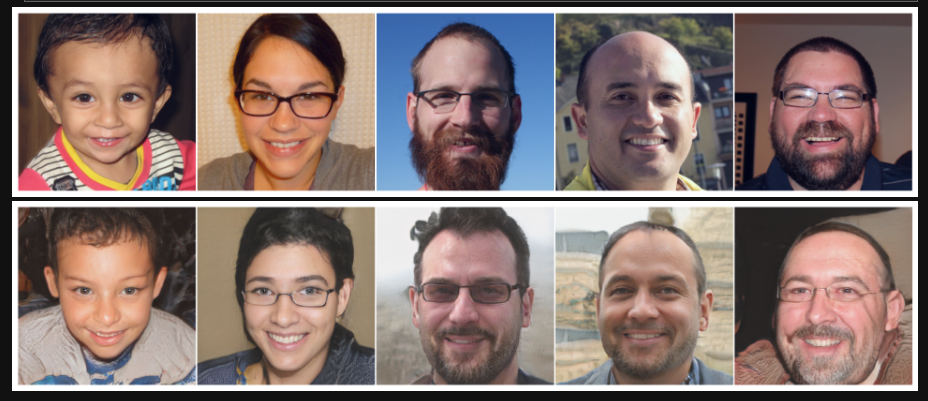

# 🙃 GAN inversion through latent codes of pretrained encoder
by Nikita Khoroshavtsev, Nikita Kurdiukov, Sergey Karpukhin @ Skoltech

**GAN inversion** is a problem where given real image $x$ we want to obtain a latent code $z$ in latent space of GAN, that corresponds to generation of image $\hat x$ identical to $x$. Inverting to latent space of GAN allows to edit images according to latent editing directions. Existing encoder-based approaches rely on training encoder from zero or jointly with GAN, while utilizing real data. 

In this project we propose following approach: given pretrained `Generator()` and pretrained self-supervised encoder `Encoder()` let's learn a map `m()` between their latent spaces. This allows to bypass need for real data, as problem is formulated as regression on latent codes and allows to train a lot more efficiently. 

We obtain very strong results with MNIST dataset and promissing results with FFHQ 256x256. Resulting images and evaluation metrics are presented below.

## Results

### MNIST (DCGAN + SimCLR/CLIP-ViT16)

We are able to obtain almost perfect reconstruction quality with a simple MLP mapping architecture. Details of training and various ablation studies can be found in `mnist/experiment.ipynb` notebook.

Additionally we are able to obtain a **robust map** that is able to perform inpainting during inference, reconstructing masked images.

### FFHQ 256x256 (StyleGANv1 + CLIP-ViT16)

We were not able to reconstruct samples FFHQ perfectly with loss on latents alone. However, a lot of higher-order semantic features are preserved and it's future work to make quality better.

In our work we experiment with two variations of simple mapping architecture and present table with results. Details of architectures and training setups can be found in `stylan/stylegan_clip.ipynb` in according sections.

|  | **FID** | **Inception Score** | **LPIPS** |
| ------------- | ------------- |------------- | ------------- |
| **MLPv1**  | **30.503**  | **4.12**  | 0.52  | 
| **MLPv2**  | 47.110  | 3.037  | **0.488** |
| **MLPv2** (with masking)  | 53.735  | 2.803 | 0.492  |

In short, MLPv1 is a MLP with Dropout and skip-connection, whilte MLPv2 uses inner-representations from Image Encoder to capture low-level information.

### Additional results

Additionally we experimented with cifar-10 dataset and StyleGAN2 architecture, but results with them were not satisfactory. In particular, with cifar-10 we faced quality problems since the GAN itself was of poor quality, and StyleGAN2 results converged into trivial solutions.

## Credits

1. Pretrained GAN for toy datasets - https://github.com/csinva/gan-vae-pretrained-pytorch

2. StyleGAN implemetation in pytorch with FFHQ checkpoints - https://github.com/rosinality/style-based-gan-pytorch

3. Official CLIP implementation - https://github.com/openai/CLIP

## References

1. W. Xia, Y. Zhang, Y. Yang, J.-H. Xue, B. Zhou, and M.-H. Yang, “GAN Inversion: A Survey.” arXiv, Mar. 22, 2022. doi: [10.48550/arXiv.2101.05278](10.48550/arXiv.2101.05278)
2. J. Donahue, P. Krähenbühl, and T. Darrell, “Adversarial Feature Learning.” arXiv, Apr. 03, 2017. doi: [10.48550/arXiv.1605.09782](10.48550/arXiv.1605.09782)
3. Y. Wang, W. Zhou, J. Bao, W. Wang, L. Li, and H. Li, “CLIP2GAN: Towards Bridging Text with the Latent Space of GANs.” arXiv, Nov. 27, 2022. doi: [10.48550/arXiv.2211.15045](10.48550/arXiv.1605.09782)
4. Stanislav Pidhorskyi, Donald Adjeroh, Gianfranco Doretto, “Adversarial Latent Autoencoders”, arxiv, Apr. 9 2020. doi: [10.48550/arXiv.2004.04467](10.48550/arXiv.1605.09782)
5. J. Zhu, D. Zhao, B. Zhang, and B. Zhou, “Disentangled Inference for GANs with Latently Invertible Autoencoder.” arXiv, Mar. 01, 2022. Accessed: May 27, 2024. [Online]. Available: [http://arxiv.org/abs/1906.08090](http://arxiv.org/abs/1906.08090)
6. J. Zhu, Y. Shen, D. Zhao, and B. Zhou, “In-Domain GAN Inversion for Real Image Editing.” arXiv, Jul. 16, 2020. doi: [10.48550/arXiv.2004.00049](10.48550/arXiv.2004.00049)
7. O. Tov, Y. Alaluf, Y. Nitzan, O. Patashnik, and D. Cohen-Or, “Designing an Encoder for StyleGAN Image Manipulation.” arXiv, Feb. 04, 2021. doi: [10.48550/arXiv.2102.02766](10.48550/arXiv.2102.02766)
8. G. Perarnau, J. van de Weijer, B. Raducanu, and J. M. Álvarez, “Invertible Conditional GANs for image editing.” arXiv, Nov. 19, 2016. Accessed: May 22, 2024. [Online]. Available: [http://arxiv.org/abs/1611.06355](http://arxiv.org/abs/1611.06355)