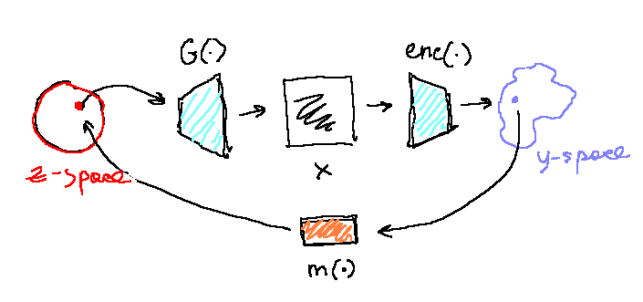

#  GAN inversion through latent codes of pretrained encoder

Given pretrained `Generator()` and pretrained self-supervised encoder `Encoder()` let's learn a map between their latent codes - and inverse this GAN!

### Weights

### References

1.
2.
3.